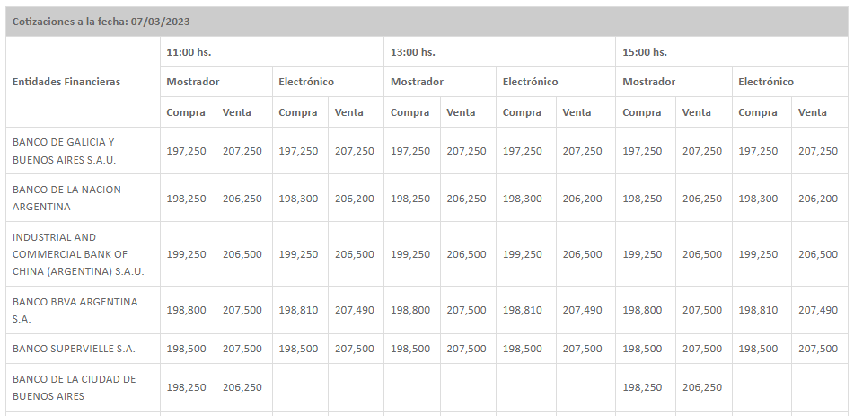

#  Financial ETL - BCRA Data Ingestion
Example of an extensible ETL process with Real-world data recollection. This process extracts and integrates data from the official backend API of Argentina's Central Bank institution (BCRA), an unexposed API source allowing easy collection and access of otherwise unaccessible data. The project intends to demonstrate the extraction and integration of useful data-sources from diverse financial institutions into a valid schema and posterior storage into a database system.

## Objective:
- Extract official exchange rate data from an official backend government API for ARS/USD. 
- Transform, parse, and clean data, makint it ready for storage. 
- Integrate and embed it with other financial data sources form brokers, into a coherent dataset and schema.
- Loading data onto persistence layer, a local database (with possible future extension to Cloud storage).  

## Nice Features
- Extraction from unexposed API: The project leverages a real-world API from the BCRA National reporting website for data extraction. This allows access to data that is not publicly available through other means.  

- Rich HTML extraction: Use of Python Multi-level Hierarchical Dataframes and custom extraction classes to easily extract raw HTML data from official BCRA website API. This also allows easy psoterior data manipulation and organization, supporting reusability by other team-members (abstracting complex complex table data parsing and supporting `stack()` and `unstack()` methods for data simplicity).

- Data transformation: The extracted data is transformed into appropriate schema data types using Pydantic. This helps to enforce data integrity and ensure that the data is usable for downstream processing.The extracted data is also cleaned and formatted for further processing.  

- Extensible design: The project is designed to be extensible, with support for multiple sources and classes. This allows for easy integration of new data sources and data types as needed.  

- Custom exceptions and error messages: Custom exception and descriptive error messages, making it easier for developers to collaborate and reuse code. This helps to improve code quality and reduce development time.


## Introduction: Use case

Having access to Financial data from an such an Original public source can be really useful. More so in such a volatile economy like the one of Argentina, where the US Dollar Exchange Rate is important asset both bussiness and market desitions of companies and minorist interest. Having access to near real time exchange rates from an original source it's key in such scenarios. 

The Central Bank of Argentina has access to a network of banks systems from which it regularly retrieves sample exchange rate information at regular intervals intervals (11hs, 13hs, 15hs) from every financial baking institution available. All these information then gets published regularly on a daily report. 

The report is served as Public information on BCRA's web page following a request. Can be accesed online through a Web Browser and rendered on Tables with no easy export solution or support. 

We are going to web-scrape and integrate such source so that is is available in our database directly from the BCRA, leveragin it's interbank network in order to get Daily Exchange rate prices from all the Argentinian banks in the network, ingest that into a Database Datawarehouse solution, allowing posterior analytics, such as "which is the bank with the lowest Exchange Rate price" or "How fast has the Exchange rate being evolving over time per Banking institution" which is somehting not usually available if not from this source.


<br>

#  Web Page - Exchange rate information -  Raw Data:     
The information is served once per request in an unaccessible way, a HTML web page with multiple tables with Exchange rate data with different uses. 
The format also contains Multi-level hierachical columns which make the processing of the source object more difficult to be actually resilient.  
We are going to automate the request-making, and parse all information into appropiate data-structures and schedule this into an ETL job 
in order to get this to target database in a easy, resilient, user-friendly and repetible way.

## <u> _Exchange Rate Table source:_</u>  




```html
<html lang="es">   

	<script>
    // SCRIPT CONTENT
    </script>
	
    <head>
        <!-- HEAD CONTENT -->
    </head>

<body>
<div class="container">
	<div class="contenido">
	<br>
	<table colspan="3" class="table table-BCRA table-bordered table-hover table-responsive">
		<thead>
			<tr>
				<td colspan="13">
					<b>Cotizaciones a la fecha: 07/03/2023</b>
				</td>
			</tr>
		</thead>
		<tbody><tr>
			<td width="18%" rowspan="4"><b>Entidades Financieras</b></td>
		</tr>
		<tr>
			<td width="23%" colspan="4"><b>11:00 hs.</b></td>
			<td width="26%" colspan="4"><b>13:00 hs.</b></td>
			<td width="25%" colspan="4"><b>15:00 hs.</b></td>
		</tr>
		
		<tr>
			<td width="12%" colspan="2"><b>Mostrador</b></td>
			<td width="11%" colspan="2"><b>Electrónico</b></td>
			<td width="12%" colspan="2"><b>Mostrador</b></td>
			<td width="14%" colspan="2"><b>Electrónico</b></td>
			<td width="14%" colspan="2"><b>Mostrador</b></td>
			<td width="11%" colspan="2"><b>Electrónico</b></td>
		</tr>
		<tr>
			<td width="6%"><b>Compra</b></td>
			<td width="6%"><b>Venta</b></td>
			<td width="6%"><b>Compra</b></td>
			<td width="5%"><b>Venta</b></td>
			<td width="6%"><b>Compra</b></td>
			<td width="6%"><b>Venta</b></td>
			<td width="7%"><b>Compra</b></td>
			<td width="7%"><b>Venta</b></td>
			<td width="7%"><b>Compra</b></td>
			<td width="6%"><b>Venta</b></td>
			<td width="7%"><b>Compra</b></td>
			<td width="4%"><b>Venta</b></td>
		</tr>

 		<tr>
			<td width="18%">BANCO DE GALICIA Y BUENOS AIRES S.A.U.                                                                                                                          </td>
			<td width="6%">
		197,250&nbsp;</td>
			<td width="6%">
		207,250&nbsp;</td>
			<td width="6%">
		197,250&nbsp;</td>
			<td width="5%">
		207,250&nbsp;</td>
			<td width="6%">
		197,250&nbsp;</td>
			<td width="6%">
		207,250&nbsp;</td>
			<td width="7%">
		197,250&nbsp;</td>
			<td width="7%">
		207,250&nbsp;</td>
			<td width="7%">
		197,250&nbsp;</td>
			<td width="6%">
		207,250&nbsp;</td>
			<td width="7%">
		197,250&nbsp;</td>
			<td width="4%">
		207,250&nbsp;</td>
		</tr>
        
 		<tr>
			<td width="18%">BANCO DE LA NACION ARGENTINA                                                                                                                                                                                                                                  </td>
			<td width="6%">
		198,250&nbsp;</td>
			<td width="6%">
		206,250&nbsp;</td>
			<td width="6%">
		198,300&nbsp;</td>
			<td width="5%">
		206,200&nbsp;</td>
			<td width="6%">
		198,250&nbsp;</td>
			<td width="6%">
		206,250&nbsp;</td>
			<td width="7%">
		198,300&nbsp;</td>
			<td width="7%">
		206,200&nbsp;</td>
			<td width="7%">
		198,250&nbsp;</td>
			<td width="6%">
		206,250&nbsp;</td>
			<td width="7%">
		198,300&nbsp;</td>
			<td width="4%">
		206,200&nbsp;</td>
		</tr>
        
 		<tr>
			<td width="18%">INDUSTRIAL AND COMMERCIAL BANK OF CHINA (ARGENTINA) S.A.U.                                                                                                      </td>
			<td width="6%">
		199,250&nbsp;</td>
			<td width="6%">
		206,500&nbsp;</td>
			<td width="6%">
		199,250&nbsp;</td>
			<td width="5%">
		206,500&nbsp;</td>
			<td width="6%">
		199,250&nbsp;</td>
			<td width="6%">
		206,500&nbsp;</td>
			<td width="7%">
		199,250&nbsp;</td>
			<td width="7%">
		206,500&nbsp;</td>
			<td width="7%">
		199,250&nbsp;</td>
			<td width="6%">
		206,500&nbsp;</td>
			<td width="7%">
		199,250&nbsp;</td>
			<td width="4%">
		206,500&nbsp;</td>
		</tr>


```


